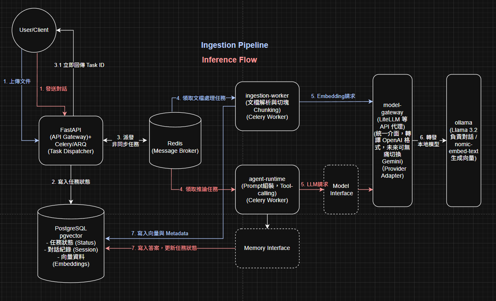

# First Agent – AI Agent 平台 (first_agent)

本專案是一個可部署的 AI Agent 平台，整合 LLM 推論服務、Tool Calling、向量檢索、快取層、資料庫與容器化架構，目標打造一個可擴充、可觀測、可模組化的 Agent Infrastructure。

目前專案主線：
- 🎯 核心能力：LLM Agent + Tool Calling + RAG
- 🧠 支援模型：Ollama（Local LLM）為主，可抽換 Provider
- 🔁 架構設計：API 層、Agent 層、服務整合層分離
- 🚀 擴充方向：多 Agent 協作、任務型 Workflow、雲端部署

---

## 系統架構



核心資料流：
* Offline (Ingestion Pipeline): 文件資料 → Chunking → Embedding → Vector Store（PostgreSQL + pgvector）
* Online (Inference Flow): User → API (FastAPI) → Agent Orchestrator →
Tool Calling / RAG / Memory → LLM（Ollama） → Response

系統主要模組如下：

1. **API Layer（對外服務層）**
   - 技術：FastAPI
   - 特性：
        - Async 架構，支援高併發流量
        - 自動生成 OpenAPI Docs
        - 統一依賴注入設計
   - 主要端點：
        - POST /upload: 上傳文件 
        - POST /chat：Agent 對話
        - GET /tasks/{task_id}: 提供前端 Polling 進度與結果
        - POST /tools/*：工具呼叫 API
        - GET /health：健康檢查

2. **Agent Core（核心推理層）**
   - 核心元件：
        - Agent Orchestrator
        - Tool Registry
        - Prompt Manager
        - Session Memory
   - 支援：
        - Function / Tool Calling
        - 多步驟推理（ReAct-like Flow）
        - RAG Retrieval
        - Context 組裝與壓縮
    - 設計理念:
        - 與 LLM Provider 解耦，可替換模型來源
        - 支援多 Agent 協作與 Workflow 自動化

3. **LLM Provider Layer**
   - 目前使用：Ollama（Local LLM 推論服務）
   - 設計理念：
        - Provider 可替換：支援本地模型或雲端 API
        - Embedding 與 Chat Model 分離
   - 未來可擴充：
        - OpenAI、企業內部模型服務等

4. **Database & Vector Store（DB Layer）**
   - 技術：PostgreSQL + pgvector
   - 功能：
        - 儲存文件 Metadata 與 embeddings
        - 紀錄 Chat Sessions、任務狀態
        - 提供相似度檢索（Vector Search）
    - 特性：
        - 與 Agent Core 與 LLM Provider 整合，支援 RAG（Retrieval-Augmented Generation）
        - 使用 SQLAlchemy ORM 與 Alembic 管理 schema


5. **Cache & Async Task Layer**
   - Redis
        - 作為 Message Broker，負責 Agent 與 Worker 任務的非同步傳遞
        - 儲存短期快取，如即時對話狀態、暫存計算結果
   - Celery
        - 非同步任務管理器，負責：
            - 文件向量化、資料處理 pipeline
            - LLM 推論任務排程與分流
            - 長耗時或批量任務的背景執行
        - 與 Redis 緊密整合，確保任務可靠傳送與重試

---

## 專案目錄結構
專案採用 DDD (領域驅動設計) 的精神，明確劃分 API 路由、非同步任務、AI 邏輯與底層資料庫介面。
```markdown
first_agent
├── 應用層 (Application)
│   ├── src/api/             # FastAPI 路由與應用程式入口 (Gateway)
│   └── src/shared/          # 共用核心模組 (Core, DB Interfaces, Schemas)
│       ├── core/            # 環境變數與全域日誌設定
│       ├── db/              # SQLAlchemy 2.0 基礎建設 (Session, Models, CRUD Repo)
│       └── schemas/         # Pydantic DTO (Data Transfer Objects)
│
├── 非同步任務與 AI 邏輯 (Workers & AI Flow)
│   ├── src/agent_runtime/   # Inference Flow (LLM 對接、LangChain 邏輯、Celery 任務)
│   └── src/ingestion/       # Ingestion Flow (文件解析、向量化管線、Celery 任務)
│
├── 基礎設施與配置 (Infra & Config)
│   ├── alembic/             # 資料庫 Schema 遷移腳本 (Migration)
│   ├── db_init/             # PostgreSQL 初始設定 (init.sql)
│   ├── scripts/             # 環境初始化腳本 (ollama-init.sh)
│   ├── tests/               # Pytest 自動化測試套件 (支援 Nested Transaction)
│   ├── alembic.ini          # Alembic 設定檔
│   ├── docker-compose.yml   # 容器編排
│   └── pyproject.toml       # Poetry 套件與依賴管理
```

---

---

## 系統分層說明
```markdown
本專案採用：
API Layer → Agent Core → Tool / Retrieval → LLM Provider
```
- 優勢：
    - 清楚責任邊界
    - 可單獨替換 LLM Provider
    - 可升級為多 Agent 架構
    - 易於單元測試
---


## 快速啟動
### 1. 建立與啟動環境
> **Note**
> 本專案使用 Docker Compose 進行微服務編排，請確保本機已安裝 Docker，且以下 Port 未被佔用：
> - 8000    : FastAPI
> - 5432    : PostgreSQL
> - 6379    : Redis
> - 11434   : Ollama

```markdown
git clone https://github.com/chihjolin/first_agent.git
cd first_agent
# 啟動所有基礎設施與服務容器
docker-compose up -d --build
```
### 2. 服務存取入口
- API Docs: http://localhost:8000/docs
- Health Check: http://localhost:8000/health
- Ollama: http://localhost:11434


### 3. API 測試範例
```markdown
非同步架構設計下，API 會立即回傳 Task ID，請使用該 ID 輪詢 (Poll) 執行結果。
# 1. 發送對話請求
curl -X POST http://localhost:8000/api/chat \
     -H "Content-Type: application/json" \
     -d '{"query": "什麼是 RAG？"}'
# Response: {"task_id": "550e8400-e29b-41d4-a716-446655440000", "status": "PENDING"}

# 2. 查詢任務狀態與結果
curl -X GET http://localhost:8000/api/tasks/550e8400-e29b-41d4-a716-446655440000
```

---

## 技術棧 (Tech Stack)
- **Backend**: FastAPI, Pydantic
- **Database / Vector Store**: PostgreSQL + pgvector
- **Cache / Message Broker**: Redis 
- **Async Task Queue**: Celery 
- **LLM Orchestration**: LangChain, LiteLLM 
- **LLM Runtime**: Ollama (Llama 3.2, nomic-embed-text)
- **Migration**: Alembic
- **DevOps**: Docker Compose
- **Testing & Tooling**: Pytest, Poetry

---

## 專案進度 (Project Progress)
🎯核心目標：建立一個可延展、可部署、可商業化的 AI Agent 基礎架構
### 已完成 (✅)
- ✅ feature/01-infra-setup
    - 基礎設施與環境變數建置 (Docker, Redis, Postgres, Ollama)。
- ✅ feature/02-db-interface
    - 確立資料合約。完成 SQLAlchemy 非同步連線設定、ORM 映射 (Mapped Models)、Alembic 遷移，以及導入 Repository Pattern 實作高效能 CRUD 與向量搜尋。
- ✅ feature/03-fastapi-broker
    - 實作 API 路由層。接收前端請求 -> 寫入 DB Task 狀態 (Pending) -> 推送任務至 Redis -> 立即回傳 Task ID 給 Client。


### 待開發 (🚧)
- 🚧 feature/04-worker-celery
    - 建立 Celery Worker 基礎架構，打通非同步任務狀態更新的 E2E 骨幹。
- 🚧 feature/05-ingestion-pipeline
    - 實作 RAG 文件處理管線 (PDF 解析 -> Chunking -> Vectorization -> pgvector 儲存)
- 🚧 feature/06-agent-inference
    - 整合 LiteLLM 與 LangChain，對接 Ollama 執行Agent 對話推論。

